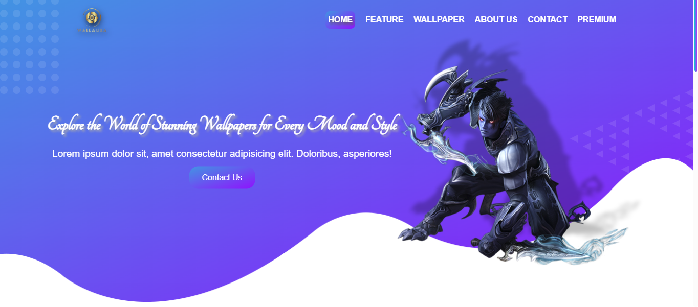

# WallAura 🌟  
**WallAura** is a responsive and visually stunning wallpaper website designed to provide users with high-quality wallpapers and seamless browsing experience. Built with **HTML**, **CSS**, **JavaScript**, and **jQuery**, it includes features such as animations, a client testimonials slider, and a sleek UI design.

---

## 🚀 Features
- **Beautiful Wallpapers**: Browse HD wallpapers for every mood and style.
- **Daily Updates**: Discover new wallpapers every day.
- **Easy Search**: Quickly find wallpapers using the search functionality.
- **Secure Access**: Your browsing experience is safe and secure.
- **Multi-Device Support**: Optimized for all devices, from desktops to mobiles.
- **Curated Collections**: Explore hand-picked collections of wallpapers.
- **Interactive Animations**: Eye-catching animations powered by AOS (Animate On Scroll).
- **Client Testimonials**: Showcase of what users say about WallAura.

---

## 🖥️ Technologies Used
- **Frontend**: HTML5, CSS3, JavaScript, jQuery
- **Frameworks/Libraries**:
  - [Bootstrap 5.3.3](https://getbootstrap.com/)
  - [jQuery](https://jquery.com/)
  - [Slick Carousel](https://kenwheeler.github.io/slick/)
  - [AOS.js](https://michalsnik.github.io/aos/)
  - [Particles.js](https://vincentgarreau.com/particles.js/)

---

## 📖 Getting Started
### Prerequisites
- A modern web browser (e.g., Chrome, Firefox, Edge).

### Run Locally
1. Clone the repository:  
   ```bash
   git clone https://github.com/manthanthakor/WallAura.git
   cd WallAura
2. Open index.html in your browser.

---

## View Live
Visit the live website: [**WallAura**](https://manthanthakor.github.io/WallAura/)

---

## 📸 Screenshots
Header Section


Feature Section

Wallpaper Gallery

---

## ✨ Future Enhancements
- Add advanced filters for wallpapers (e.g., categories, AI-generated wallpapers, premium options).
- Implement a lightbox effect for viewing images.
- Add a user registration and login system for personal collections.
- Enhance search functionality to include tags and keywords.

--- 

## 🛠️ Dependencies
- Bootstrap
- jQuery
- Slick Carousel
- AOS.js
- Particles.js
- FontAwesome

---

## 📝 License
This project is licensed under the MIT License. Feel free to use and modify as needed.

---

## 💡 Author
- Manthan Thakor
- GitHub: [@manthanthakor](https://github.com/ManthanThakor)
- Email: thakormanthan948@gmail.com

---

Feel free to modify this as needed for your project!

